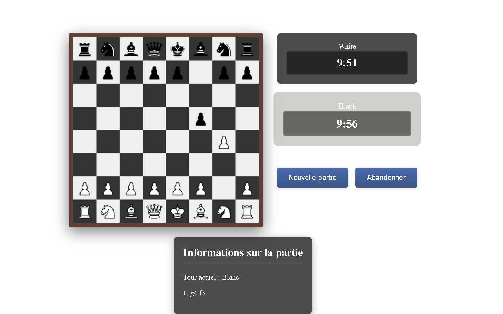

# ♟️ Chess – Real-time Web Chess Game (Prototype)



Welcome to our **web-based chess game** built with HTML, CSS, JavaScript, and Node.js. The goal of this project was to create a dynamic and user-friendly interface for playing chess, with authentication, session management, and an attempted real-time multiplayer feature.

## 🚀 Features

- Full chessboard with piece movement
- Basic game logic and rules validation
- User authentication system
- SQLite database for user management
- Session and security management (Helmet, rate limiting, sanitize-html)
- Attempted implementation of real-time multiplayer with Socket.IO (incomplete due to time constraints)

## 🛠 Technologies Used

- **Frontend**: HTML, CSS, JavaScript
- **Backend**: Node.js, Express
- **Database**: SQLite
- **Real-time Communication**: Socket.IO
- **Security**: Helmet, Express Rate Limit, sanitize-html
- **Authentication**: bcrypt, express-session

## 📁 Project Structure

/Chess
├── front-end/ │ ├── accueil.html │ ├── game.html │ ├── accueil_script.js │ └── game.js 
├── back-end/ │ ├── server.js │ └── database.db
├── package.json └── README.md


## 📦 Installation & Setup

1. **Clone the repository**:
   ```bash
   git clone https://github.com/KRIDAmani/Chess.git
   cd Chess ```

2. **Install dependencies**:
    ```npm install ```

3. **Run the server**:
  ```cd back-end
   node server.js```

4. **Access the game**: After running the server, open your browser and go to:
   ```http://localhost:3000/accueil.html```

## ⚠️ About Multiplayer

We planned to include a **real-time multiplayer mode** allowing two players to play on the same chessboard using **Socket.IO**.  
However, due to **limited time**, this feature wasn't fully implemented.

If you have experience in real-time multiplayer logic using **WebSockets** or **Socket.IO**, feel free to reach out — I’d love to discuss and learn more! 💬

---

## 👩‍💻 Author

**Amani Krid**  
🔗 [LinkedIn](https://www.linkedin.com/in/amani-krid-63aa3723a)  
📫 Contact: [kridamani.pro@gmail.com]

---

## 📄 License

This project is licensed under the **ISC License**.
